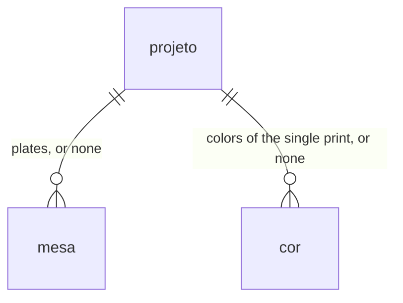
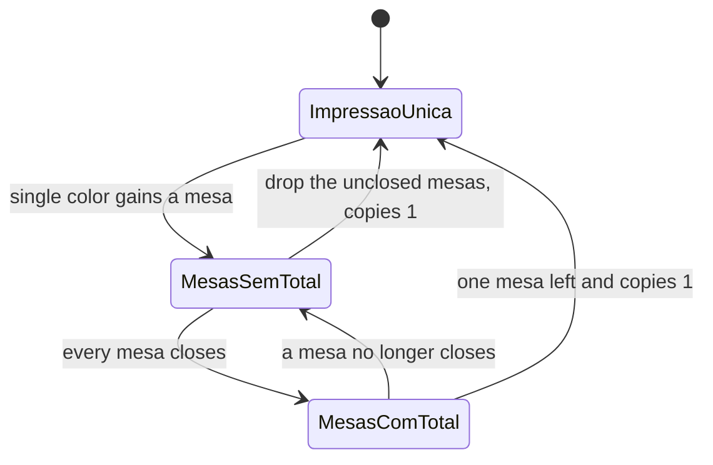
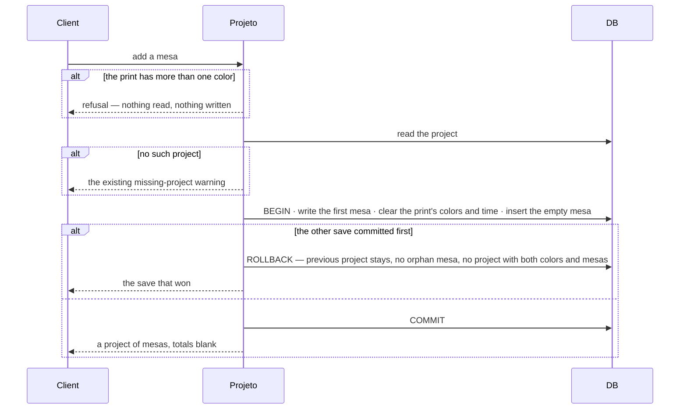

# Mesas

> Plan from this document. Each slice below carries its own shape - copy it, do not re-derive it.
> Status: confirmed by the owner, 2026-10-08

## Situation

- Project: in steady use
- Decision: committed by the owner, 2026-10-08, in this document
- In flight: a project already stores one print — mode, copies, time, labor, one printer, and colors — and the list shows the lot recomputed from the printer's current tariff. Filament stock and the project's client stay on the backlog.
- At stake: one-way

## Problem

The owner prices on this computer. Without a CFS on the K2, or an AMS on a Bambu, each print takes one spool from the rack, so a product that wants several colors becomes several plates. Today each plate is its own calculation and the reais are added outside the app. One saved project whose total is that product stays impossible. The owner said on 2026-10-08 that this is not rare: projects generally have this shape when there is no AMS or CFS. The example in the slicer was three plates of one product.

## Success

- Worked if: the next quote of several plates is one project, and its total is the sum that was done outside the app
- Going wrong: that product is still saved as one project per plate
- Review: that first quote — the owner

## Boundary

In: a project made of mesas. Each mesa is one plate: one time, one filament, its price per kilogram and its grams. The product total sums the mesas. Copies multiply the product. Labor is one percent. The printer is one.

Out: purge, a failed print, scrap, labor by the hour, a tariff per project, login, and a quote as PDF or text — already out of this version. A mesa with several colors — that is one print, which the calculator already prices. Filament stock and the project's client — backlog. Splitting the cost of different parts that share a plate — the plate is one time and one filament. Copies per mesa, and a printer per mesa — copies and the printer belong to the project.

Unchanged: `impressora`, `impressora_ativa`, `/`, `/projetos`, `/configuracoes`. On a single print, `mode`, `color_mode`, peça, lote, and several colors in one time. The list still shows the lot, and the tariff still follows the printer. Typed numbers stay text. Labor's base is still material plus energy plus depreciation.

## Prior art

- Without a filament changer, one plate is one spool and a multi-color product is several plates — we take it. Creality treats a multi-color file as a single color when the CFS is off; Bambu's AMS is what would have kept those colors in one print.
- Pricing several plates as one time undercounts energy and depreciation — Key decision 4.
- AMS and CFS purge on every color change inside one print — we do not, because these plates never swap filament mid-print, and purge is out of this version.

## Shape

A mesa stores one plate's time and one filament. The project sums each mesa's material, energy and depreciation, applies labor once, and multiplies the product by its copies. The door is the one filament: several colors on a mesa would rewrite every mesa and collapse it into the single print. Each mesa as a full print, with its own mode, copies and colors, pays off only if a plate without CFS has several colors, and it does not.

## Key decisions

1. **A project is either one print or a list of mesas, never both.** The single print keeps its time, `color_mode` and colors. Mesas are the plates printed without CFS or AMS. A saved row with no mesas is still one print.

2. **A mesa is one spool: one time and one filament.** The filament is a name, a hex, a price per kilogram and grams. The same color on two mesas is typed twice, price and all.

3. **The piece is the sum of the mesas. The lot is that sum times the project's copies.** Copies sit on the project. Once the project has mesas, copies do not divide the plates the way lote divides one print.

4. **Labor is the project's percent, applied once to the sum of the mesas.** Each mesa adds its own energy and depreciation from its own time and the project's printer.

5. **One mesa that does not close blanks the piece and the lot.** Time, grams or price empty or invalid is enough. Zero mesas is not this record; that is the single print.

6. **Only a single-color print can gain a mesa, and the totals from before survive the round trip.** The print becomes the first mesa, as one product. A new mesa that has not closed blanks the total. Removing every mesa that never closed, with copies at 1, restores the single print and the piece and lot from before. A print with more than one color gains nothing and stays one print. With copies other than 1, a remaining mesa stays a project of mesas, and its piece and lot stay what they were before the extra mesa.

7. **Nothing already saved is rewritten until the owner adds a mesa.** The project still does not store the total.

## Work

| Slice | Delivers | Status |
|---|---|---|
| [Mesa](#mesa) | Piece and lot for a project of mesas | clear |
| [Projeto](#projeto) | Open, save, duplicate, delete and list a project of mesas, and turn a single-color print into mesas | clear |

Order: Mesa → Projeto.

Already handled by existing code: a missing printer uses the marked one and the screen warns; a missing project on `/?projeto=` warns and a save creates a new id; a single print in peça, lote, one color or several colors; no colors on a single print leaves material at zero; the list sorts by recency and then by name.

Derivable from the repository, left to the plan: typed text, pt-BR decimals, integer copies, hours and minutes both filled, empty versus invalid versus zero, life hours at zero, a mesa id unique inside the project and reusable across projects, mesa order, duplicate naming with “ (cópia)”, delete of the project taking its mesas, and field warnings — all as the single print and `cor` do them.

### Mesa

**Delivers** the piece and the lot of a project of mesas. **Status: clear.**

| State | What should happen | Caller sees |
|---|---|---|
| Every mesa closes and copies are an integer greater than zero | Key decision 3 and Key decision 4 | Piece is the sum; lot is the sum times copies |
| One mesa has time, grams or price empty or invalid | Key decision 5 | Piece and lot blank; that mesa shows the open field |
| Copies empty, invalid or zero | The piece stays the sum; the lot does not close | Lot blank. “Custo do lote bloqueado. Cópias do produto precisa ser um inteiro maior que zero.” |

Table `mesa`. `projeto` gains no columns. While the project has mesas, `projeto.hours`, `projeto.minutes` and `projeto.grams` are empty text, `projeto.mode` is `peca`, `projeto.color_mode` is `unica`, and `cor` has no rows for that project — Key decision 1.

| Column | Type | Null | References | Note |
|---|---|---|---|---|
| `id` | text | no | | With `projeto_id`, the primary key |
| `projeto_id` | text | no | `projeto.id` | Deleted with the project, as `cor` is |
| `hours` | text | no | | Typed text, as `projeto.hours` |
| `minutes` | text | no | | Typed text, as `projeto.minutes` |
| `name` | text | no | | Filament name; empty is allowed |
| `hex` | text | no | | |
| `price` | text | no | | R$/kg, typed text |
| `grams` | text | no | | Grams of that plate |
| `posicao` | integer | no | | Order inside the project, as `cor.posicao` |

Primary key (`projeto_id`, `id`). No other index.

A project has mesas or colors, not both. A mesa has no child color. Checked against `projeto` and `cor`: today the colors hang off the project, and the mesa does not exist yet.

Alternatives considered: a `cor` row pointing at the mesa — wins if one filament record is shared by several mesas, which is the filament stock on the backlog.

### Projeto

**Delivers** a saved project of mesas, including the step that turns a single-color print into the first mesa. **Status: clear.** This slice is the door.

| State | What should happen | Caller sees |
|---|---|---|
| Open a project of mesas | The plates load with the project | Each mesa's time and filament; piece and lot from Mesa |
| Add a mesa to a print with more than one color | Key decision 6. Nothing is written | “Esta impressão tem várias cores num tempo só. A mesa leva uma cor.” The single print stays |
| Add a mesa to a single-color print | Key decision 6 | Totals blank until the new mesa closes |
| Remove the mesas that never closed, copies at 1 | The single print returns with the piece and lot from before | The calculator of one print |
| Remove mesas until one remains, copies not 1 | Key decision 6. It stays a project of mesas | Piece and lot equal the ones from before the extra mesa |
| Remove a closed mesa while another remains | The sum is redone without it | Piece and lot from Mesa |
| Save | The project and its mesas replace the previous ones together. A failed save leaves the previous project | The saved project, or the bank error the screen already shows |
| Save lands on a project the other save already replaced | The loser writes nothing. No project keeps both colors and mesas | The save that committed |
| Duplicate | The new project carries the mesas | Name with “ (cópia)”; same piece and lot |
| Delete | The project and its mesas go together | The list without that project |
| List | Key decision 7. The lot is recomputed from the printer's current tariff | The lot, and how many mesas the project has. A single print shows no mesa count |

Alternatives considered: copies divide the sum, as lote divides one print — wins if each sliced plate is already the whole batch. The owner enters one product's plates and multiplies.

## Migration

Existing `projeto` rows stay one print. The `mesa` table starts empty. No backfill and no rewrite of time, copies or colors. A payload with no mesas is one print. The owner is the only client; the next time the app opens, old projects still show the calculator of one print.

## Sources

- [K2 Series Multi-color Printing Guide](https://www.creality.com/blog/k2-series-multi-color-printing-guide) — with the CFS off, the K2 prints from the rack and a multi-color file is treated as a single color
- [Bambu Lab AMS](https://us.store.bambulab.com/products/ams-multicolor-printing) — the AMS holds several spools and switches them so one print can carry several colors
