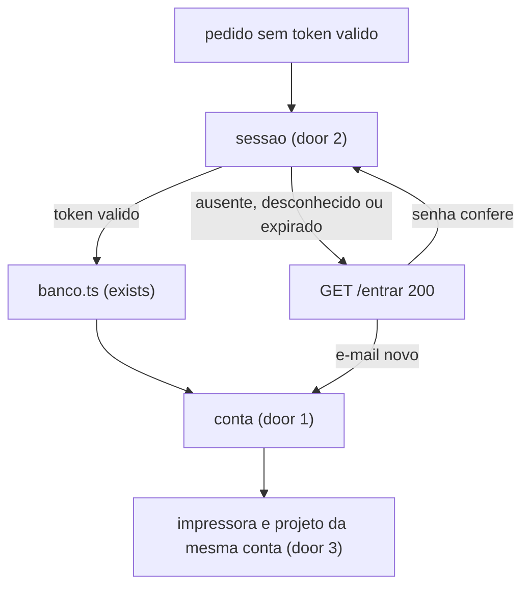
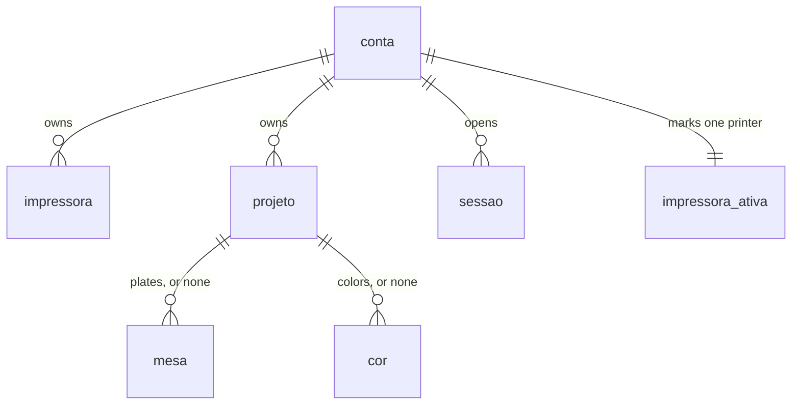

# Login

## Problem

Quem abre a porta 4317 neste computador lê e grava toda impressora e todo projeto. Não há conta. O dono paga por isso: uma segunda pessoa nesta máquina, ou qualquer um com o endereço, altera a K2 Pro e os lotes dele. O dono pediu contas separadas em 2026-10-08. Quantas pessoas vão entrar não foi medido; ele disse que, por enquanto, só gente conhecida abriria.

Quando isto chega, a calculadora, a lista e as configurações só abrem depois do e-mail e da senha. A segunda conta não vê a impressora nem o projeto da primeira.

## Flow

Isto reusa `banco.ts` (exists) para ler e gravar impressoras e projetos. A fórmula em `custo.ts` (exists) não entra no caminho. O cookie não é lido dentro de `banco.ts`.

1. GET `/`, `/projetos` ou `/configuracoes` sem token válido para em `sessao` (door 2) e responde 307 para `/entrar`. `banco.ts` (exists) não é lido.
2. A primeira conta nasce de `SENHA_ADMIN` em `conta` (door 1), com a senha em scrypt (door 4), e as linhas já gravadas passam a ser dela (door 3).
3. E-mail e senha novos entram em `conta` (door 1) na mesma transação da K2 Pro dessa conta (door 3).
4. O formulário em `/entrar` envia `POST /sessao`. Senha que confere grava `sessao` (door 2) e devolve o cookie.
5. GET com token válido segue para `banco.ts` (exists), que lê e grava só as linhas dessa conta (door 3).
6. O admin redefine a senha de outra conta (door 1) e apaga as linhas de `sessao` dessa outra conta (door 2).
7. out: `/`, `/projetos` e `/configuracoes` mostram impressoras, projetos e a impressora marcada dessa conta.

## Impact

| Front | What changes |
| --- | --- |
| domain | new term: `conta` — um e-mail, uma senha e o papel `admin` ou `comum`. A primeira é `pablorgds@gmail.com`, papel `admin` |
| domain | new term: `sessao` — um token opaco no cookie `sessao` e uma linha no banco, com prazo de 7 dias |
| domain | existing term: "sem conta" era o estado do app — `vistas.ts`, `docs/dados.md`, a primeira frase de `AGENTS.md`, o backlog do `README.md` e AD-001. Passa a ser "esta conta". AD-001 fica superseded by AD-005 |
| stored data | as linhas atuais de `impressora` e `projeto` passam para `pablorgds@gmail.com` na mesma transação que cria essa conta. O id `k2-pro` deixa de ser único no banco inteiro. `impressora_ativa` deixa de ser uma linha só para o banco inteiro. A cópia do `localStorage` deixa de olhar a semente global |
| stored data | a prova antiga "leitura e escrita sem cookie" em `src/lib/banco.test.ts` afirma o contrário do que este plano exige. Ela muda para provar a recusa sem sessão |

## Relations

Restrições de mão única: e-mail único sem distinção de maiúsculas (door 1); o papel `admin` é só de `pablorgds@gmail.com` (door 1); id de impressora único dentro da conta e repetível em outra conta (door 3); uma impressora marcada por conta, e ela é uma impressora dessa conta (door 3); token de sessão único (door 2). Sem colunas e sem tipos aqui.

## Surface

| Route | In | Out | Status |
| --- | --- | --- | --- |
| `GET /entrar` | cookie `sessao` opcional | título `Entrar` com `E-mail`, `Senha`, `Entrar` e `Criar conta`; ou `Falta a senha da primeira conta.`; ou `Não deu para ler o banco.`; ou redireciona para `/` se o token vale | 200, 307 |
| `GET /` | cookie `sessao` | calculadora dessa conta, ou redireciona para `/entrar` | 200, 307 |
| `GET /projetos` | cookie `sessao` | projetos dessa conta, ou redireciona para `/entrar` | 200, 307 |
| `GET /configuracoes` | cookie `sessao` | impressoras dessa conta; se o papel é `admin`, os e-mails das outras contas. Sem token, redireciona para `/entrar` | 200, 307 |
| `POST /sessao` | form `acao`, `email`, `senha`; cookie `sessao` opcional | grava ou apaga o cookie `sessao` e redireciona | 303 |

## Landing

| One-way door | Literal shape | Alternative rejected |
| --- | --- | --- |
| 1. Conta | uma linha por e-mail, índice único em `lower(email)`. Papel `admin` ou `comum`. A única `admin` é `pablorgds@gmail.com`, criada quando não existe conta e `SENHA_ADMIN` tem 8 ou mais caracteres. A senha dessa conta não entra no repositório | tabela de papéis, porque outro papel está fora; mais de um admin, porque o design nomeia a primeira conta |
| 2. Sessão | tabela `sessao` com token opaco aleatório. O cookie `sessao` leva só esse token, `HttpOnly`, `SameSite=Lax`, `Path=/`, sem `Secure`, `Max-Age` 604800. Redefinir a senha apaga as linhas dessa conta | JWT com `jose`, porque a redefinição precisa invalidar na hora e `jose` é dependência nova; `Secure: true`, porque o app é HTTP em `4317` e o navegador não enviaria o cookie |
| 3. Dono da linha | `impressora` passa a ter chave primária `(conta_id, id)`. `impressora_ativa` passa a ter chave primária `conta_id`, apontando para uma impressora dessa conta. `projeto` ganha o dono e o id do projeto continua único no banco. Na transação que cria o admin, toda `impressora` e todo `projeto` já gravados passam a ser dele | chave primária global em `impressora.id`, porque a segunda conta também nasce com id `k2-pro`; uma `impressora_ativa` global, porque as duas contas marcariam a mesma máquina |
| 4. Senha | `node:crypto` `scrypt`, sal de 16 bytes, N `16384`, r `8`, p `1`, tamanho de chave `32`, comparação com `timingSafeEqual`. A senha em claro não é gravada | pacote `bcrypt` ou `argon2`, porque adiciona módulo nativo neste container; senha em claro, porque uma cópia do volume `custo-chapa-pg` seria a senha |
| 5. Cópia do navegador | a cópia de `custo-chapa-impressora` e `custo-chapa-projetos` só roda para `pablorgds@gmail.com`, e só enquanto essa conta ainda é a semente: uma impressora `k2-pro`, nome `K2 Pro`, watts `150`, energyPrice `1.18`, printerPrice `7979`, lifeHours `3000`, e zero projetos dela | a semente global de hoje, porque uma conta nova também é uma K2 Pro e zero projetos e importaria o `localStorage` daquele navegador para o banco |

- Nada mais nesta mudança é difícil de reverter

## Criteria

### S1: As três telas pedem a conta (P1)

Sem cookie válido, a calculadora, a lista e as configurações não abrem.

**Acceptance Criteria**

1. WHEN GET `/` carries no cookie `sessao` THEN the system SHALL respond 307 with Location `/entrar`.
2. WHEN GET `/projetos` carries no cookie `sessao` THEN the system SHALL respond 307 with Location `/entrar`.
3. WHEN GET `/configuracoes` carries no cookie `sessao` THEN the system SHALL respond 307 with Location `/entrar`.
4. WHEN GET `/entrar` carries no cookie `sessao` and at least one conta exists THEN the system SHALL respond 200 with the title `Entrar`.
5. WHILE `/entrar` is shown and at least one conta exists the system SHALL show the fields `E-mail` and `Senha` and the controls `Entrar` and `Criar conta`.
6. WHEN GET `/entrar` carries a valid `sessao` THEN the system SHALL respond 307 with Location `/`.
7. IF the cookie `sessao` is not a stored token or its expiry is already past THEN GET `/` SHALL respond 307 with Location `/entrar`.
8. IF Postgres refuses the connection THEN GET `/entrar` SHALL respond 200 with the title `Não deu para ler o banco.` and SHALL NOT include the field `Senha`.

**Independent test:** pedido sem cookie a `/`, `/projetos` e `/configuracoes` devolve 307 para `/entrar`. Com o Postgres parado, `/entrar` mostra `Não deu para ler o banco.`

### S2: A primeira conta fica com o que já está gravado (P1)

`pablorgds@gmail.com` recebe as linhas atuais. Qualquer outra conta nasce com a K2 Pro e zero projetos.

**Acceptance Criteria**

9. WHEN no conta exists and `SENHA_ADMIN` is `segredo-inicial` THEN the system SHALL persist one conta with email `pablorgds@gmail.com` and papel `admin`, and every impressora and projeto row that already existed SHALL belong to that conta.
10. IF no conta exists and `SENHA_ADMIN` is missing, empty, or shorter than 8 characters THEN the system SHALL persist zero conta rows and GET `/entrar` SHALL respond 200 with the title `Falta a senha da primeira conta.`
11. The system SHALL NOT persist the characters of `SENHA_ADMIN` on the conta. The stored verifier SHALL be scrypt with a 16-byte salt, N `16384`, r `8`, p `1` and key length `32`.
12. WHEN login submits email `pablorgds@gmail.com` and the password equal to `SENHA_ADMIN` THEN the system SHALL set cookie `sessao`.
13. WHEN signup submits email `outra@example.com` and password `senha-oito` THEN the system SHALL persist that email in lowercase, one impressora id `k2-pro`, name `K2 Pro`, watts `150`, energyPrice `1.18`, printerPrice `7979`, lifeHours `3000`, and zero projetos for that conta.
14. IF signup submits an email whose lowercase form is already stored THEN the system SHALL persist one conta for that email and SHALL show `Esse e-mail já tem conta.`
15. IF signup password is `1234567` THEN the system SHALL NOT persist a conta for that email and SHALL show `A senha precisa de 8 caracteres.`
16. IF signup email is `sem-arroba` THEN the system SHALL NOT persist a conta and SHALL show `E-mail inválido.`
17. IF the transaction that creates a new conta and its K2 Pro rolls back THEN the system SHALL persist neither that conta nor an impressora for it.
18. WHEN two signups of email `dup@example.com` and password `senha-oito` commit together THEN the system SHALL persist one conta with that email.
19. WHEN the admin conta is still the seed and `custo-chapa-projetos` parses to a list THEN the admin's first authenticated read SHALL persist that list on the admin conta only.
20. IF a non-admin conta is one impressora `k2-pro` with the seed texts and zero projetos THEN the system SHALL NOT persist `custo-chapa-projetos` or `custo-chapa-impressora` from that request into the database.

**Independent test:** subir com `SENHA_ADMIN`, entrar como `pablorgds@gmail.com` e ver o lote que já estava no volume. Criar `outra@example.com` e ver uma K2 Pro e `Nenhum projeto salvo`.

### S3: Uma conta não abre a linha da outra (P1)

O admin também não abre. A tela dele só lista e-mail para redefinir senha.

**Acceptance Criteria**

21. WHILE the session conta is `outra@example.com`, GET `/projetos` SHALL list only projetos of that conta.
22. WHILE the session papel is `admin`, GET `/projetos` SHALL NOT include a projeto name stored only on `outra@example.com`.
23. IF `/?projeto=<id>` names a projeto of another conta THEN the system SHALL show `Esse projeto não está no banco. Salvar cria um novo.` and SHALL leave the other conta's marked impressora unchanged.
24. IF a write names an impressora id owned by another conta THEN the system SHALL leave that impressora's name, watts, energyPrice, printerPrice and lifeHours unchanged.
25. IF a save names a projeto id owned by another conta THEN the system SHALL leave that projeto's name unchanged and the caller's conta SHALL NOT own that id.
26. The system SHALL keep exactly one marked impressora per conta, and that id SHALL be an impressora of the same conta.
27. WHEN two contas each have an impressora id `k2-pro` THEN both rows SHALL remain.
28. IF a removal would leave that conta with zero impressoras THEN the system SHALL keep at least one impressora id of that conta even when another conta still has impressoras.

**Independent test:** duas contas, um projeto com nome `Só da outra` na segunda. Na primeira, `/projetos` não mostra esse nome, e `/?projeto=` desse id mostra o texto de projeto ausente.

### S4: O admin redefine a senha de outra conta (P2)

A conta comum não redefine senha. Ninguém redefine a do admin por esta tela.

**Acceptance Criteria**

29. WHILE the session papel is `admin` and `outra@example.com` exists, Configurações SHALL show `outra@example.com`.
30. WHILE the session papel is `comum`, Configurações SHALL NOT show `Redefinir senha`.
31. WHEN the admin list contains `a@example.com` and `m@example.com` THEN `a@example.com` SHALL appear before `m@example.com`.
32. WHILE the admin session has no other conta, Configurações SHALL show `Nenhuma outra conta.`
33. WHEN `Redefinir senha` is activated once for `outra@example.com` THEN the system SHALL NOT change that conta's verifier.
34. WHEN `Redefinir` is then activated with password `nova-senha` THEN a login of `outra@example.com` with `senha-oito` SHALL show `E-mail ou senha não confere.` and SHALL NOT set cookie `sessao`.
35. WHEN that reset has committed THEN a login of `outra@example.com` with `nova-senha` SHALL set cookie `sessao`.
36. WHEN that reset commits THEN every sessao of `outra@example.com` SHALL be gone and the admin sessao SHALL remain.
37. IF a reset targets `pablorgds@gmail.com` THEN the system SHALL keep that conta's verifier.
38. IF the session papel is `comum` and a reset is submitted for any email THEN the system SHALL keep every verifier unchanged.
39. IF the new password on reset is `1234567` THEN the system SHALL keep the previous verifier and SHALL show `A senha precisa de 8 caracteres.`

**Independent test:** no admin, redefinir `outra@example.com` para `nova-senha` e ver a senha antiga recusada. Na conta comum, o controle `Redefinir senha` não aparece.

### S5: Entrar, sair e o cookie (P1)

**Acceptance Criteria**

40. WHEN login email and password do not match a stored conta THEN the system SHALL show `E-mail ou senha não confere.` and SHALL NOT set cookie `sessao`.
41. WHEN login email is `ninguem@example.com` THEN the system SHALL show `E-mail ou senha não confere.`
42. IF login email or login password is empty THEN the system SHALL show `Preencha e-mail e senha.` and SHALL NOT set cookie `sessao`.
43. WHEN login email is `Outra@Example.com` and the password matches the stored conta THEN the system SHALL set cookie `sessao`.
44. WHEN login succeeds THEN cookie `sessao` SHALL be HttpOnly, SameSite `Lax`, Path `/`, not Secure, and the stored expiry SHALL be 7 days after that login.
45. WHEN `Sair` is activated THEN the next GET `/` SHALL respond 307 with Location `/entrar` and that token SHALL NOT remain stored.
46. WHEN login fails THEN stdout SHALL contain `entrada recusada` and SHALL NOT contain the submitted password.
47. WHEN two logins of the same conta both succeed THEN both tokens SHALL read that conta, and one `Sair` SHALL remove only the token that was sent.
48. WHILE a valid sessao is presented the header SHALL show `Sair`.

**Independent test:** entrar, ver `Sair`, sair, e o próximo `/` voltar 307. Errar a senha e ver `E-mail ou senha não confere.` sem o cookie.

### S6: O texto que ainda diz que não há conta (P2)

**Acceptance Criteria**

49. WHILE the printer and project read has not returned, Configurações SHALL show `As impressoras desta conta ficam no banco deste computador.`
50. WHILE the printer and project read has not returned, Projetos SHALL show `Os projetos desta conta ficam no banco deste computador.`
51. The system SHALL say in `docs/dados.md` that each conta has its own impressoras and projetos.
52. The system SHALL say in `docs/arquitetura.md` that `/entrar` is a route and that `/`, `/projetos` and `/configuracoes` respond 307 to `/entrar` without a valid sessao.
53. The system SHALL say in the first paragraph of `AGENTS.md` that the calculator asks for the conta, and that paragraph SHALL NOT contain `Sem conta`.
54. The README backlog sentence SHALL NOT contain `login`.

**Independent test:** abrir Configurações e Projetos e ler a frase de carregamento. `docs/dados.md` nomeia a conta.

## Out of scope

| Excluded | Why |
| --- | --- |
| URL acessível fora desta máquina | o design deixa para depois que a pessoa entra e uma conta não lê a outra |
| Envio de e-mail para recuperar senha | o design deixa de fora; a senha da primeira conta vem de `SENHA_ADMIN` |
| A pessoa logada troca a própria senha | o design só dá redefinição ao admin, e só sobre outra conta |
| Outros papéis além de `admin` e `comum` | o design deixa de fora |
| Publicar a porta do Postgres no host | AD-002; a credencial continua a de desenvolvimento |
| Estoque de filamentos, cliente do projeto, PDF, refugo | o design deixa o resto do backlog de fora |
| Fórmula de peça, lote e mesas | o design marca `/`, `/projetos`, `/configuracoes`, peça, lote e mesas como unchanged |

## Assumptions

| Assumption | Chosen default | Rationale | Confirmed? |
| --- | --- | --- | --- |
| O admin vê impressoras, projetos ou configurações de outra conta | não vê e não edita; Configurações só lista o e-mail das outras contas para redefinir a senha | O dono disse `admin não vê` em 2026-10-08. Os AC 21 a 28 escrevem isso | y |

**Open questions:** none.

## Observable

| Surface | Decision | Landing |
| --- | --- | --- |
| screen `/entrar` | empty | AC 4 and AC 5 — fields start empty; this screen is the logged-out state |
| screen `/entrar` | loading | n/a - the form does not wait on a list; connection failure is AC 8 |
| screen `/entrar` | error | AC 10, AC 14, AC 15, AC 16, AC 40, AC 42 |
| screen `/entrar` | unauthorised | n/a - this screen is where an unauthorised request lands |
| screen `/entrar` | ordering | AC 5 — `Entrar` and `Criar conta` on the same screen, fields `E-mail` then `Senha` |
| screen `/entrar` | destructive action confirms | n/a - signup does not delete an existing row; a duplicate email is AC 14 |
| screen `/`, `/projetos`, `/configuracoes` | unauthorised | AC 1, AC 2, AC 3, AC 7 |
| screen `/`, `/projetos`, `/configuracoes` | loading | AC 49 and AC 50 |
| screen `/`, `/projetos`, `/configuracoes` | error | existing - title `Não deu para ler o banco.` when the read fails after a valid sessao |
| screen Calculadora | empty | n/a - it is a form; a missing or foreign projeto uses AC 23 |
| screen Projetos | empty | existing - card `Nenhum projeto salvo` when that conta has zero projetos |
| screen Projetos | ordering | existing - `updatedAt` descending, then name in pt-BR, now within the conta |
| screen Projetos | destructive action confirms | existing - second click `Apagar` in the project list |
| screen Configurações | empty impressoras | n/a - each conta keeps at least one impressora, AC 28 |
| screen Configurações | admin list empty | AC 32 |
| screen Configurações | admin list ordering | AC 31 |
| screen Configurações | duplicate emails | AC 14 and AC 18 — one conta per lowercase email |
| screen Configurações | admin email in the list | AC 37 — `pablorgds@gmail.com` is not a reset target |
| screen Configurações | destructive reset | AC 33 then AC 34 |
| screen Configurações | error | AC 39 |
| screen header | logout | AC 45 and AC 48 |
| all new `GET /entrar` | versioning, rate limits | n/a - no client outside this repo calls these routes, and the public URL is out of scope |
| document `docs/dados.md` | what the reader does next | AC 51 |
| document `docs/arquitetura.md` | structure | AC 52 |
| document `AGENTS.md` and `README.md` | the sentence that still says there is no conta | AC 53 and AC 54 |

## Sources

- `.design/login.md` — contas separadas, primeira conta `pablorgds@gmail.com` como admin que redefine senha, conta nova com a K2 Pro e zero projetos, URL pública e e-mail de recuperação fora
- `.specs/STATE.md` AD-001 — um banco e nenhuma sessão; este plano supersede com AD-005. AD-002 permanece: Postgres sem porta no host
- `.specs/features/ambiente-banco/plan.md` — impressoras e projetos já estão no volume `custo-chapa-pg`; a cópia do navegador só enquanto a semente
