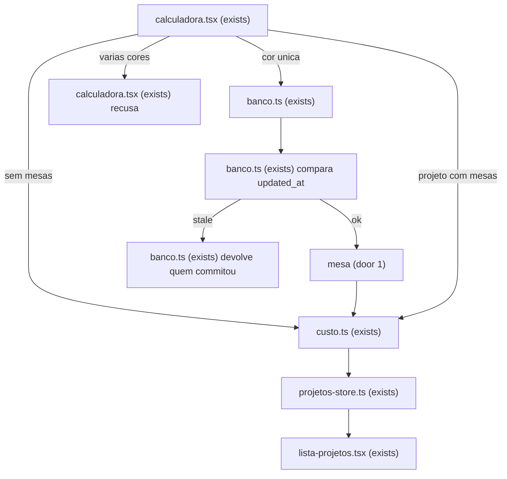
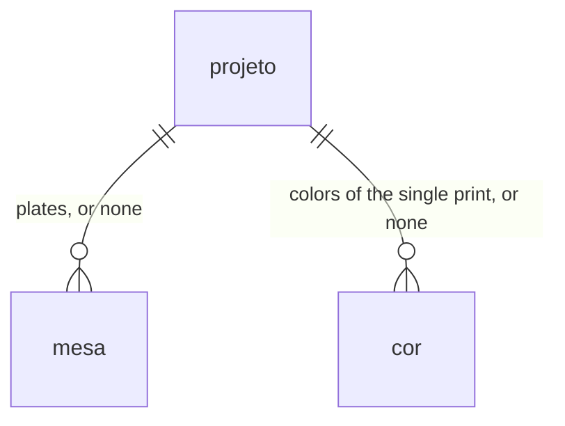

# Mesas

## Problem

Quem precifica neste computador, sem CFS na K2 e sem AMS na Bambu, tira um rolo do rack por impressão. Um produto de várias cores vira várias chapas. Hoje cada chapa é um projeto, e os reais são somados fora do app. Um projeto só, cujo total é esse produto, continua impossível.

O dono disse em 2026-10-08 que isso não é raro: sem AMS ou CFS, o projeto em geral tem essa forma. O exemplo no fatiador foi três chapas de um produto.

Quando isto chega, o próximo orçamento de várias chapas é um projeto, e o total é a soma que era feita fora do app.

## Flow

Reusa `parseDecimal`, `parseInteger`, `combineTime` e a conta de material, energia e depreciação que uma chapa já tem em `custo.ts`. A mão de obra continua um percentual sobre material + energia + depreciação, uma vez sobre a soma das chapas. A impressão única, sem mesa, continua no mesmo `calculate`.

## Impact

| Front | What changes |
| --- | --- |
| domain | new term: `mesa` — uma chapa, um tempo e um filamento, somada no produto. Vive no projeto |
| domain | existing term: "mesa" na impressão única significa a chapa cheia do modo lote ("Cópias na mesa", "Peso da mesa") — `calculadora.tsx` ramifica nessas frases. Elas ficam na impressão única. No projeto de mesas, a cópia do produto não usa essa frase |
| domain | existing term: projeto era uma impressão (modo, cópias, tempo, mão de obra, cores) — `parseProject`, `lerProjetos`, `lista-projetos.tsx`, `calculadora.tsx` e `draftToCalcInput` ramificam nisso. Agora é essa impressão ou uma lista de mesas, nunca as duas |
| domain | existing term: cópias no modo lote dividem a chapa — `scale` em `custo.ts` e o campo de cópias ramificam nisso. Com mesas, as cópias multiplicam o produto. A ida e a volta com cópias `1` devolve a peça e o lote de antes; com cópias diferentes de `1`, uma mesa que sobra permanece mesa e o lote passa a ser a chapa vezes as cópias |
| stored data | a tabela `mesa` nasce vazia. Nenhum `projeto` já gravado é reescrito até o dono adicionar uma mesa. Um payload sem mesas continua uma impressão. O total continua fora do projeto |

## Relations

Um projeto tem mesas ou cores, não as duas (door 2). O id da mesa é único dentro do projeto e pode repetir em outro projeto (door 1). `projeto` não ganha coluna. Sem colunas e sem tipos aqui.

## Surface

None - nothing consumed outside. `/`, `/projetos` e `/configuracoes` continuam as mesmas rotas, e `?projeto=` continua o mesmo.

## Landing

| One-way door | Literal shape | Alternative rejected |
| --- | --- | --- |
| Tabela `mesa` | `CREATE TABLE mesa (projeto_id text NOT NULL REFERENCES projeto (id) ON DELETE CASCADE, id text NOT NULL, hours text NOT NULL, minutes text NOT NULL, name text NOT NULL, hex text NOT NULL, price text NOT NULL, grams text NOT NULL, posicao integer NOT NULL, PRIMARY KEY (projeto_id, id))`. `projeto` não ganha coluna. Horas, minutos, preço e gramas ficam texto, como manda AD-003. Nome vazio é texto vazio | cada mesa como outro `projeto`, com modo, cópias e cores — uma chapa sem CFS tem um rolo, e o total do produto continuaria fora da linha |
| Gravacao sem as duas famílias | na mesma transação, payload com mesas faz `DELETE FROM cor WHERE projeto_id = $1` e payload sem mesas faz `DELETE FROM mesa WHERE projeto_id = $1`. O commit fica só de um lado. Enquanto há mesas, `hours`, `minutes` e `grams` do projeto são `""`, `mode` é `peca` e `color_mode` é `unica` | uma linha de `cor` apontando para a mesa — isso é o estoque de filamentos do backlog, e o projeto passaria a ter cores e chapas ao mesmo tempo |
| Gravação que perdeu a corrida | o write carrega o `updated_at` que a tela leu. `UPDATE` e o insert das filhas só seguem se `projeto.updated_at` ainda for esse valor. Se não for, `ROLLBACK` e a leitura devolve o projeto que commitou | a última gravação ganha — a tela atrasada substituiria a que já commitou, e as duas abas discordariam do banco |

- Nada mais nesta mudança é difícil de reverter

## Criteria

A impressora dos números abaixo, quando o critério não disser outra, é 1000 W, R$ 1/kWh, R$ 1000 e 1000 h. A outra impressora citada é 100 W, R$ 1/kWh, R$ 1000 e 1000 h.

### S1: Peça e lote das mesas (P1)

A peça é a soma das chapas. O lote é essa soma vezes as cópias do produto. Uma chapa que não fecha zera os dois lados.

**Acceptance Criteria**

1. WHEN a project has two mesas, each with hours `1`, minutes `0`, grams `0`, price `0` and labor `0`, THEN the system SHALL price the piece at material `0`, energy `2`, depreciation `2`, labor `0` and total `4`
2. WHEN the project in AC 1 has copies `2` THEN the system SHALL price the lot at material `0`, energy `4`, depreciation `4`, labor `0`, total `8` and minutes `240`
3. WHEN a project has two mesas of hours `0` and minutes `0`, each with grams `1000` and price `100`, labor `10` and copies `1`, THEN the system SHALL price the piece at material `200`, energy `0`, depreciation `0`, labor `20` and total `220`
4. IF any mesa has hours, minutes, grams or price empty or invalid THEN the system SHALL set the piece total to null and the lot total to null
5. IF copies is empty, `0` or not an integer greater than zero, and every mesa closes, THEN the system SHALL keep the piece total and set the lot total to null
6. IF copies is empty, `0` or not an integer greater than zero THEN the system SHALL show `Custo do lote bloqueado. Cópias do produto precisa ser um inteiro maior que zero.`
7. WHEN life hours is `0` and the mesas in AC 1 otherwise close THEN the system SHALL price depreciation at `0` and the piece total at `2`
8. WHEN a mesa price is `1,5`, its grams are `1000`, its time is `0` and labor is `0` THEN the system SHALL price that filament's material at `1.5`
9. WHEN every mesa's time, grams and price close and a mesa name is empty THEN the system SHALL close the piece total
10. IF the labor percent is empty THEN the system SHALL set the piece total to null and the lot total to null
11. WHEN a project has no mesas, mode `lote`, copies `2`, 60 minutes, labor `20`, one color of 10 g at R$ 100/kg and another of 20 g at R$ 50/kg, on the 100 W printer, THEN the system SHALL price the piece total at `1.86` and the lot total at `3.72`
12. WHEN a mesa has hours `0`, minutes `0`, grams `0` and price `0` THEN the system SHALL treat that mesa as closed

**Independent test:** duas chapas de 1 h com a impressora de 1000 W fecham peça `4` e, com 2 cópias, lote `8`; esvaziar o preço de uma chapa deixa peça e lote sem total.

### S2: Projeto de mesas (P1)

Abrir, gravar, duplicar, apagar e listar um projeto de mesas, e transformar uma impressão de uma cor na primeira mesa.

**Acceptance Criteria**

13. WHEN a saved project of mesas is opened THEN the system SHALL show each mesa's hours, minutes, name, hex, price and grams in ascending `posicao`
14. WHEN the owner adds a mesa to a print with more than one priced color THEN the system SHALL show `Esta impressão tem várias cores num tempo só. A mesa leva uma cor.` and leave the stored print unchanged
15. WHEN the owner adds a mesa to a single-color print of hours `1`, minutes `0`, grams `10`, filament name `PLA preto`, hex `#111111` and price `100` THEN the system SHALL store that plate as the first mesa with those values, append a mesa with empty hours, minutes, name, price and grams and hex `#57534e`, clear that project's colors and time, and show `—` for the piece total and the lot total
16. WHEN a single-color print in mode `peca` shows piece total `2.52` and lot total `2.52` for 60 minutes, 10 g at R$ 100/kg, labor `20` and the 100 W printer, and the owner adds a mesa and then removes every mesa that has not closed, with copies `1` THEN the system SHALL store mode `peca`, hours `1`, minutes `0`, grams `10`, one color, no mesa, piece total `2.52` and lot total `2.52`
17. WHEN a project already has two closed mesas and copies `1`, and the owner removes a mesa that has not closed THEN the system SHALL keep both closed mesas and their piece total and lot total
18. WHEN a lote print of copies `4`, 60 minutes, 10 g at R$ 100/kg and labor `20` on the 100 W printer gains a mesa, and the owner removes the mesa that has not closed THEN the system SHALL keep one mesa, copies `4`, piece total `2.52` and lot total `10.08`
19. WHEN the owner removes one closed mesa and another closed mesa remains THEN the system SHALL reprice the piece and the lot without the removed mesa
20. WHEN one closed mesa remains and copies is `1` THEN the system SHALL store that plate as a single print and store no mesa
21. WHEN the owner saves a project of mesas THEN the system SHALL store `hours`, `minutes` and `grams` as `""`, `mode` as `peca`, `color_mode` as `unica`, no `cor` row and the mesa rows, in one commit
22. IF that save fails THEN the system SHALL return, on the next read, the project from before the save
23. IF a save carries a loaded `updated_at` that is not the row's current `updated_at` THEN the system SHALL commit nothing, and the next read SHALL be the save that committed, with no project that has both a `cor` row and a `mesa` row
24. WHEN the owner duplicates a project of mesas THEN the system SHALL name the copy with the suffix ` (cópia)` and give the copy the same piece total and lot total
25. WHEN the owner deletes a project THEN the system SHALL delete that project's mesas with it
26. WHEN the list renders a project of `2` mesas, copies `4` and labor `30` THEN the system SHALL show `2 mesas · 4 cópias do produto · mão de obra 30%`
27. WHEN the list renders one mesa THEN the system SHALL show `1 mesa`
28. WHEN the list renders a project of mesas THEN the system SHALL keep the legend `lote, tarifa atual` and SHALL NOT show `sem cores` or `tempo incompleto`
29. WHEN the list renders a project with no mesas THEN the system SHALL show no mesa count
30. WHEN the `mesa` table is created THEN the system SHALL leave every existing `projeto` row as one print and SHALL leave `mesa` with zero rows
31. IF the owner adds a mesa for a `?projeto=` id that is not stored THEN the system SHALL show `Esse projeto não está no banco. Salvar cria um novo.` and SHALL insert no project and no mesa
32. WHEN the owner saves a missing `?projeto=` that is still a single print THEN the system SHALL create a new project id
33. WHILE a project has mesas the system SHALL show one field labeled `Mão de obra (%)` and one field labeled `Cópias do produto`
34. WHILE a project has mesas the system SHALL NOT show `Uma peça`, `O lote inteiro`, `Uma cor` or `Várias cores`
35. WHILE a project has no mesas the system SHALL show `Uma peça`, `O lote inteiro`, `Uma cor` and `Várias cores`
36. WHILE a project has mesas the system SHALL show `Cada mesa é uma chapa: um tempo e um filamento. A peça soma as mesas. As cópias multiplicam o produto.`
37. The system SHALL keep each mesa id unique inside one project
38. The system SHALL load the same mesa id on two projects as two plates
39. WHEN a mesa name is empty and the owner saves THEN the system SHALL store that name as `""`
40. WHEN the printer's energy price changes and the project is not saved again THEN the system SHALL reprice the listed lot from the new tariff
41. WHEN the owner saves a mesa project with an empty field THEN the system SHALL show `Campo vazio.` on that field
42. WHEN the owner saves a mesa project with an invalid number THEN the system SHALL show `Use zero ou um número positivo.` on that field
43. WHEN the owner removes a mesa THEN the system SHALL remove it without a confirmation step

**Independent test:** numa impressão de uma cor, adicionar mesa, ver peça e lote em `—`, preencher a segunda chapa e gravar; em Projetos, o lote e `2 mesas`; apagar o projeto e não sobrar mesa.

## Out of scope

| Excluded | Why |
| --- | --- |
| Purge, impressão falha, refugo, mão de obra por hora, tarifa por projeto, login, orçamento em PDF ou texto | já fora desta versão |
| Mesa com várias cores | isso é uma impressão, e a calculadora já precifica |
| Estoque de filamentos e cliente do projeto | backlog |
| Repartir o custo de peças diferentes na mesma chapa | a chapa é um tempo e um filamento |
| Cópias por mesa e impressora por mesa | cópias e impressora são do projeto |
| Quantidade em estoque, baixa de gramas, rolo diferente de 1 kg | fora do item de estoque até alguém pedir |

## Assumptions

Nenhum default fora dos critérios.

**Open questions:** none - all resolved or logged above.

## Observable

| Surface | Decision | Landing |
| --- | --- | --- |
| screen Calculadora | empty state | n/a - zero mesas não é esta ficha; a impressão única continua com `Nenhuma cor ainda. Sem filamento, o material fica em R$ 0,00.` |
| screen Calculadora | loading | existing - `Lendo impressoras e projetos.` |
| screen Calculadora | error | AC 4, AC 6, AC 14, AC 31, AC 41, AC 42 |
| screen Calculadora | unauthorised | n/a - AD-001, não há conta nem sessão |
| screen Calculadora | density and ordering | AC 13, AC 33, AC 34, AC 36 |
| screen Calculadora | destructive remove mesa | AC 43 |
| screen Projetos | empty state | existing - `Nenhum projeto salvo` |
| screen Projetos | loading | existing - `Lendo impressoras e projetos.` |
| screen Projetos | error | existing - `Não deu para ler o banco.` |
| screen Projetos | unauthorised | n/a - AD-001, não há conta nem sessão |
| screen Projetos | density and ordering | AC 26, AC 27, AC 28, AC 29 |
| screen Projetos | destructive delete | existing - segundo clique em `confirmar-apagar` antes de apagar; AC 25 leva as mesas junto |
| screen Configurações | empty, loading, error, density, destructive | n/a - esta feature não muda Configurações |
| API | error shape, caller, versioning, rate limit | n/a - nenhuma rota nova; o dono é o único cliente e a falha de banco continua `Não deu para ler o banco.` |
| document docs/custo.md e docs/dados.md | structure, tone, next step | existing - AGENTS.md já manda esses docs acompanharem a conta e as linhas gravadas |
| collection projetos | grouping, naming, duplicates, exception | AC 24, AC 26, AC 29, AC 37 |

## Sources

- `.design/mesas.md`, confirmado pelo dono em 2026-10-08 — binding para as duas fatias, as sete decisões e a tabela `mesa`
- [K2 Series Multi-color Printing Guide](https://www.creality.com/blog/k2-series-multi-color-printing-guide) — com o CFS desligado, a K2 imprime do rack e trata arquivo multicolor como uma cor
- [Bambu Lab AMS](https://us.store.bambulab.com/products/ams-multicolor-printing) — o AMS troca de rolo para uma impressão levar várias cores
